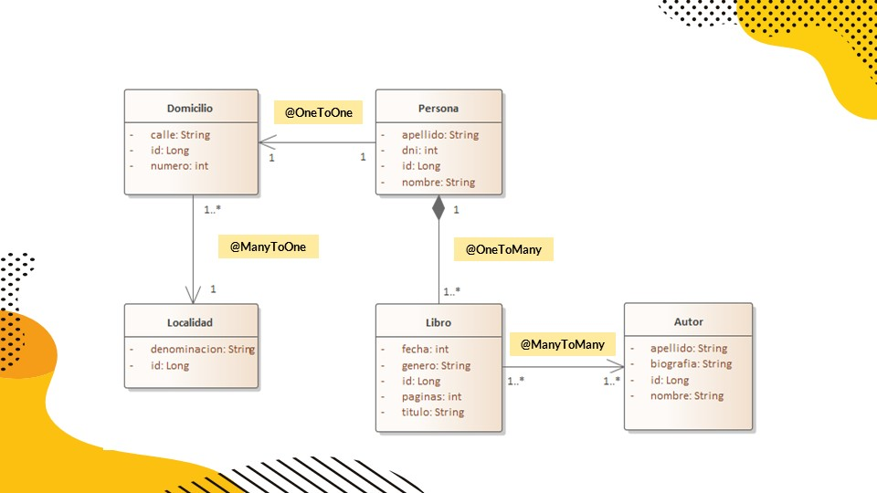

# API-REST-Libreria
API REST desarrollada a modo de prueba para aprender los conceptos enseñados en clases, siguiendo los tutoriales que fueron enviados por el profesor.      
La programacion se realizo con el IDE Spring Tools Suite , el sistema gestor de bases de datos utilizado fue SQLyog, la herramienta Postman que nos permite hacer peticiones HTTP a nuestra API y Xampp para poder levantar un servidor local. Da uso al puerto 9001, y crea una base de datos llamada db_prueabaapi. Esta API fue desarrollada a partir del sigiuente diagrama:

A traves de postman enviamos datos a traves del formato de texto JSON utilizando la siguiente sintaxis:

Para el objeto LOCALIDAD:

Get all URL = http://localhost:9001/apiPrueba/version1/localidades  
Get one URL = http://localhost:9001/apiPrueba/version1/localidades/1  
Delete URL = http://localhost:9001/apiPrueba/version1/localidades/1  

Post URL Localidad = http://localhost:9001/apiPrueba/version1/localidades  
Body del Post Localidad =     

{  
   "denominacion" : "Ciudad"  
}

Put URL Localidad = http://localhost:9001/apiPrueba/version1/localidades/1  
Body del Put Localidad =  

{  
    "id" : 3,  
    "denominacion" : "Rivadavia"  
}

Para el objeto AUTOR :

Get all URL = http://localhost:9001/apiPrueba/version1/autores  
Get one URL = http://localhost:9001/apiPrueba/version1/autores/1  
Delete URL = http://localhost:9001/apiPrueba/version1/autores/1  

Post URL = http://localhost:9001/apiPrueba/version1/autores  
Body del Post Autor =   

{  
    "nombre": "Edgar Allan",  
    "apellido": "Poe",  
    "biografia": "fue un escritor, poeta, crítico y periodista romántico estadounidense, generalmente reconocido como uno de los maestros universales del relato corto, del              cual fue uno de los primeros practicantes en su país."  
}

Put URL = http://localhost:9001/apiPrueba/version1/autores/1  
Body del Put Autor =   

{   
    "id" : 1,  
    "nombre" : "Howard Phillips",  
    "apellido" : "Lovecraft",  
    "biografia" : "más conocido como H. P. Lovecraft, fue un escritor estadounidense, autor de novelas y relatos de terror y ciencia ficción. Se le considera un gran innovador         del cuento de terror, al que aportó una mitología propia su obra constituye un clásico del horror cósmico, una línea narrativa que se aparta de las tradicionales historias         de terror sobrenatural —satanismo, fantasmas—, incluyendo elementos de ciencia ficción como, por ejemplo, razas alienígenas, viajes en el tiempo o existencia de otras             dimensiones".   
}

Para el objeto PERSONA:

Get all URL = http://localhost:9001/apiPrueba/version1/personas  
Get one URL = http://localhost:9001/apiPrueba/version1/personas/1  
Delete URL = http://localhost:9001/apiPrueba/version1/personas/1  

Post URL = http://localhost:9001/apiPrueba/version1/personas  
Body del Post Persona =   

{  
    "nombre": "Ricardo",  
    "apellido": "Martinez",  
    "dni": 36895544,  
    "domicilio": {  
        "calle": "Uruguay",  
        "numero": 333,  
        "localidad": {  
            "id": 1,  
            "denominacion": "Godoy Cruz"  
        }  
    },  
    "libros": [  
        {  
            "genero": "horror",  
            "fecha": 1845,  
            "paginas": 200,  
            "titulo": "El corazon delator",  
            "autores": [  
                {  
                    "id": 1,  
                    "nombre": "Edgar Allan",  
                    "apellido": "Poe",  
                    "biografia": "fue un escritor, poeta, crítico y periodista romántico estadounidense, generalmente reconocido como uno de los maestros universales del relato   corto, del cual fue uno de los primeros practicantes en su país."  
                }  
            ]  
        }  
    ]  
}  

Put URL = http://localhost:9001/apiPrueba/version1/personas/1  
Body del Put Persona (Se cambio el nombre, el apellido, la calle y la numeracion del domicilio) =   

{  
    "nombre": "Juan",  
    "apellido": "Scardini",  
    "dni": 36895544,  
    "domicilio": {  
        "calle": "Irlanda",  
        "numero": 321,  
        "localidad": {  
            "id": 1,  
            "denominacion": "Godoy Cruz"  
        }  
    },  
    "libros": [  
        {  
            "genero": "horror",  
            "fecha": 1845,  
            "paginas": 200,  
            "titulo": "El corazon delator",  
            "autores": [  
                {  
                    "id": 1,  
                    "nombre": "Edgar Allan",  
                    "apellido": "Poe",  
                    "biografia": "fue un escritor, poeta, crítico y periodista romántico estadounidense, generalmente reconocido como uno de los maestros universales del relato   corto, del cual fue uno de los primeros practicantes en su país."  
                }  
            ]  
        }  
    ]  
}  

Para poder probar la API es necesario deployarla utilizando en primer lugar Xampp
Link Xampp : https://www.apachefriends.org/es/download.html

Despues debemos as un RUN AS SPRING BOOT APP en nuestro IDE elegido.  
Luego abrimos nuestro gestor de bases de datos para poder visualizar los cambios si queremos.  

Y por ultimo utilizamos Postman para realizar las consultas y poder probar nuestra API.  
Link Postman: https://www.postman.com/downloads/
